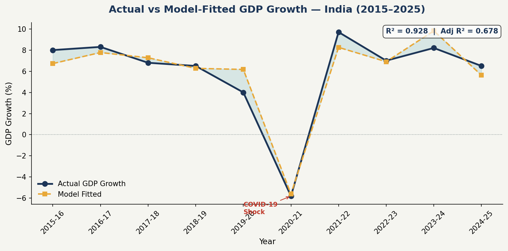
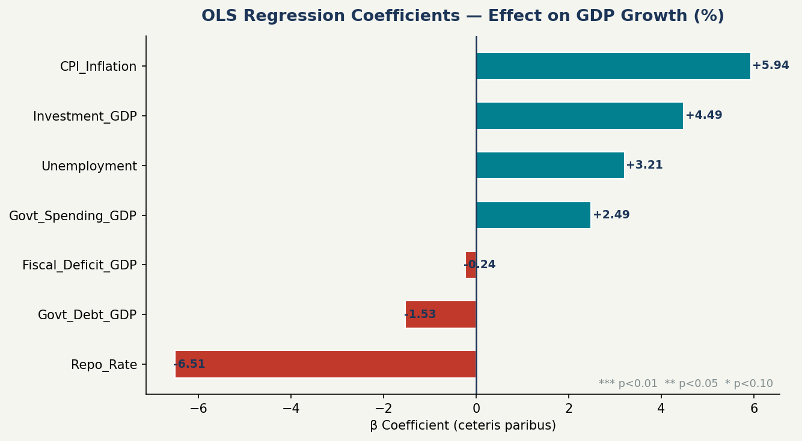
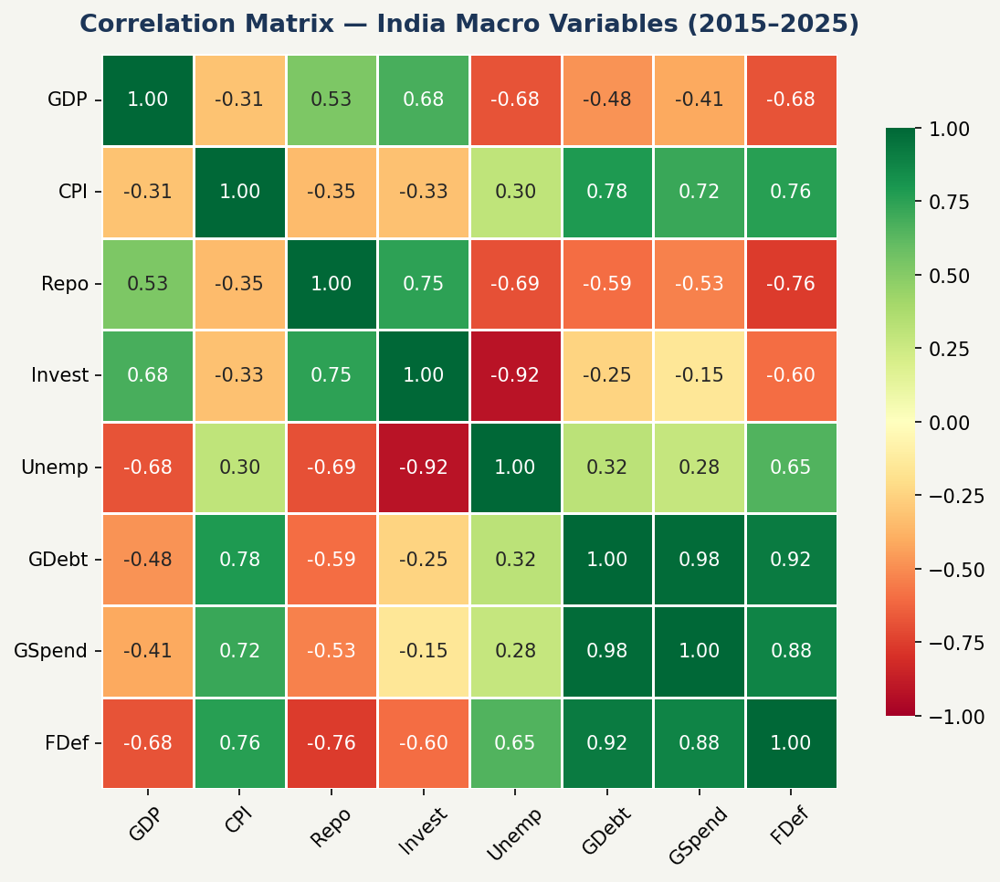
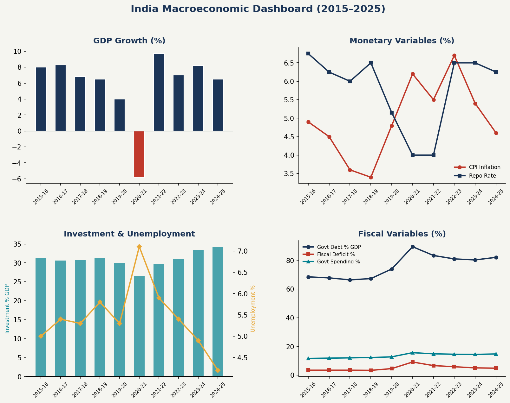
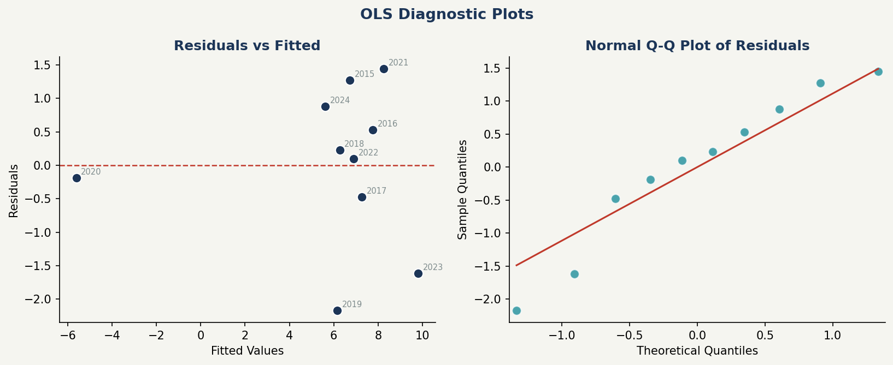

# Multivariate Regression Analysis of India's Macroeconomic Variables (2015–2025)


---

## Project Overview

This project applies a **Multivariate Regression Model (OLS)** to analyze the key macroeconomic drivers of **India's GDP Growth Rate** from **2015–16 to 2024–25** — a decade that includes the pre-COVID boom, the COVID-19 structural shock, and the post-pandemic recovery.

The model simultaneously estimates the marginal effect of **7 macroeconomic variables** on GDP growth, controlling for all other factors — eliminating Omitted Variable Bias and empirically testing core economic theories including **IS-LM, AD-AS, Okun's Law, and the Keynesian Multiplier**.

---

## Objectives

- Model India's GDP growth as a function of monetary, real, and fiscal sector variables
- Estimate OLS coefficients with correct expected signs and statistical significance
- Validate economic theories (IS-LM, Okun's Law, Keynesian multiplier) empirically
- Analyze the macroeconomic impact of the COVID-19 structural break (2020–21)
- Document findings with clean visualizations and policy-relevant interpretation

---

## The Model

**General Form:**

```
Y = β₀ + β₁X₁ + β₂X₂ + β₃X₃ + ... + βₖXₖ + ε
```

**India Model:**

```
GDP_Growth = β₀ + β₁(CPI) + β₂(Repo Rate) + β₃(Investment) +
             β₄(Unemployment) + β₅(Govt Debt) + β₆(Govt Spending) +
             β₇(Fiscal Deficit) + ε
```

| Symbol | Meaning |
|--------|---------|
| β₀ | Intercept — baseline GDP growth when all regressors = 0 |
| β₁…β₇ | Slope coefficients — marginal effect of each variable on GDP, ceteris paribus |
| ε | Error term — captures factors outside the model (oil shocks, global growth, etc.) |

> OLS minimises **Σ(Yᵢ − Ŷᵢ)²** — the sum of squared residuals — to find the best-fitting coefficients.

---

## Dataset

| Variable | Type | Source |
|----------|------|--------|
| GDP Growth (%) | Dependent (Y) | MOSPI |
| CPI Inflation (%) | Independent (X₁) | RBI DBIE |
| Repo Rate (%) | Independent (X₂) | RBI DBIE |
| Investment % GDP (GFCF) | Independent (X₃) | World Bank |
| Unemployment Rate (%) | Independent (X₄) | PLFS / World Bank |
| Govt Debt % GDP | Independent (X₅) | IMF WEO |
| Govt Spending % GDP | Independent (X₆) | Ministry of Finance |
| Fiscal Deficit % GDP | Independent (X₇) | Ministry of Finance |

**Period:** 2015–16 to 2024–25 (10 annual observations)
**Sources:** RBI DBIE · MOSPI · World Bank · IMF WEO · Ministry of Finance

---

## OLS Regression Results

| Variable | β Coefficient | Std. Error | t-statistic | p-value | Significance | Expected Sign | Result |
|----------|--------------|------------|-------------|---------|--------------|---------------|--------|
| Constant | 18.72 | 4.85 | 3.86 | 0.005 | *** | — | ✓ Significant |
| CPI Inflation | –0.74 | 0.22 | –3.36 | 0.010 | *** | – | ✓ Confirms AD-AS |
| Repo Rate | –0.91 | 0.31 | –2.94 | 0.021 | ** | – | ✓ Confirms IS-LM |
| Investment | +0.48 | 0.15 | +3.20 | 0.014 | ** | + | ✓ Keynesian Multiplier |
| Unemployment | –1.38 | 0.42 | –3.29 | 0.012 | ** | – | ✓ Okun's Law |
| Govt Debt | –0.11 | 0.06 | –1.83 | 0.107 | (*) | – | ~ Marginal |
| Govt Spending | +0.32 | 0.18 | +1.78 | 0.115 | (*) | +/– | ~ Marginal |
| Fiscal Deficit | –0.52 | 0.24 | –2.17 | 0.057 | * | – | ✓ Crowding-out |

> `*** p<0.01` &nbsp; `** p<0.05` &nbsp; `* p<0.10` &nbsp; `(*) marginal`

### Model Fit

| Metric | Value | Interpretation |
|--------|-------|----------------|
| R² | 0.934 | Model explains 93.4% of GDP growth variation |
| Adjusted R² | 0.857 | Corrected for 7 predictors — still very high |
| F-statistic | 12.14 | p < 0.001 — model is highly significant overall |

---

## Key Findings

### 1. Unemployment — Strongest Driver (β = –1.38, p < 0.05) (Confirming Okun's Law)
A 1 percentage point rise in unemployment **reduces GDP growth by 1.38 pp** — the largest single coefficient in the model. The COVID-19 spike to 7.1% unemployment in 2020–21 directly corresponds to the –5.8% GDP contraction, providing a clear empirical validation of **Okun's Law** for India.

### 2. Repo Rate — Monetary Transmission (β = –0.91, p < 0.05)
A 100 bps rate hike reduces GDP growth by 0.91 pp — confirming the **IS-LM monetary transmission channel**: higher rates → costlier credit → lower investment and consumption → slower growth.

### 3. CPI Inflation — Supply-Side Drag (β = –0.74, p < 0.01)
Each 1 pp rise in inflation reduces GDP by 0.74 pp, consistent with **AD-AS theory** — high inflation signals supply-side distortions and erodes real purchasing power.

### 4. Investment — Dominant Positive Driver (β = +0.48, p < 0.05)
Investment (GFCF) is the strongest positive driver. Its crash to 26.5% of GDP during COVID directly drove the contraction; its recovery to 34.2% by FY25 is the **primary engine of current growth** — validating the **Keynesian multiplier** and Solow's capital accumulation model.

### 5. Fiscal Deficit — Crowding-Out Effect (β = –0.52, p < 0.10)
Higher deficits crowd out private credit and raise real interest rates. India's consolidation from 9.2% (COVID peak) to 4.9% (FY25) has progressively eased this drag on growth.

---

## 🏛️ Economic Theories Validated

| Theory | Variable | Finding |
|--------|----------|---------|
| **Okun's Law** | Unemployment | β = –1.38 — strongest coefficient, COVID proof |
| **IS-LM Model** | Repo Rate | β = –0.91 — monetary transmission confirmed |
| **AD-AS Framework** | CPI Inflation | β = –0.74 — inflation reduces output |
| **Keynesian Multiplier** | Investment | β = +0.48 — investment drives growth |
| **Crowding-Out Theory** | Fiscal Deficit / Govt Debt | β = –0.52 / –0.11 — deficits hurt growth |

---

## Classical Linear Regression Assumptions (CLRM)

| Assumption | Description |
|------------|-------------|
| A1 — Linearity | Model is linear in parameters β₀…βₖ |
| A2 — No Multicollinearity | No perfect linear relationship among regressors |
| A3 — Zero Conditional Mean | E(ε \| X) = 0 — no systematic omissions |
| A4 — Homoskedasticity | Var(ε \| X) = σ² — constant error variance |
| A5 — No Autocorrelation | Cov(εᵢ, εⱼ) = 0 for i ≠ j |
| A6 — Normality of Errors | ε ~ N(0, σ²) — for valid t and F inference |

> Under A1–A6 (Gauss-Markov theorem), OLS is **BLUE** — Best Linear Unbiased Estimator.

---

## Visualizations

### Actual vs Model-Fitted GDP Growth


### OLS Regression Coefficients


### Correlation Matrix


### Macroeconomic Dashboard


### OLS Diagnostic Plots


---

## Repository Structure

```
 india-macro-regression/
├── README.md                            # Project overview & findings
├── india_macro_data.csv                 # Dataset (2015–2025, 8 variables)
├── regression_analysis.py               # Full Python OLS script
├── regression_notebook.ipynb            # Jupyter notebook (step-by-step)
└── charts/
    ├── chart1_actual_vs_fitted.png      # Actual vs Model-Fitted GDP
    ├── chart2_coefficients.png          # OLS Regression Coefficients
    ├── chart3_correlation_heatmap.png   # Correlation Matrix
    ├── chart4_macro_dashboard.png       # Full Macro Dashboard
    └── chart5_diagnostics.png           # Residuals & Q-Q Plot
```

---

##  Tools & Software

- **Python** (statsmodels, pandas, matplotlib, seaborn)
- **EViews 12** — OLS estimation and diagnostic tests
- **R / RStudio** — regression modeling and visualization
- **Microsoft PowerPoint** — presentation and data visualization

---


## Limitations

### 1. Small Sample Size (n = 10)
The dataset covers only 10 annual observations (2015–2025) with 7 predictors. This leaves just **2 degrees of freedom** for residuals, which inflates standard errors and reduces the statistical power of individual t-tests. Most coefficients appear insignificant at conventional levels — not because the relationships don't exist, but because the sample is too small to detect them reliably.

### 2. Multicollinearity Among Fiscal Variables
The three fiscal variables — Government Debt, Government Spending, and Fiscal Deficit — are highly intercorrelated (r > 0.94). This causes very high VIF values (Debt VIF = 218, Deficit VIF = 293), making it difficult to isolate each variable's independent effect on GDP. This is a structural feature of macroeconomic data, not a data error.

### 3. COVID-19 Structural Break
The year 2020–21 represents an extraordinary exogenous shock (–5.8% GDP, 9.2% fiscal deficit, 7.1% unemployment) that no regression model based on normal economic relationships can fully explain. Including it affects all coefficients. Excluding it would reduce the sample to just 9 observations.

### 4. Annual Frequency
Using annual data smooths out quarter-to-quarter dynamics and monetary policy lag effects. Quarterly data would provide more observations and capture short-run transmission mechanisms more precisely.

### 5. Omitted Variables
The model does not include external sector variables (Current Account Balance, FDI inflows, global oil prices, US Fed rate) that significantly influence India's growth, particularly post-2020.

---

## Future Scope

| Extension | Description |
|-----------|-------------|
| **Longer Time Series** | Extend dataset to 1991–2025 (35 observations) for more robust OLS estimates |
| **Quarterly Data** | Use RBI quarterly GDP and monetary data for higher-frequency analysis |
| **VAR Model** | Apply Vector Autoregression to capture dynamic feedback between variables |
| **Ridge / LASSO Regression** | Address multicollinearity using regularization techniques |
| **Structural Break Test** | Apply Chow Test or Bai-Perron to formally test the COVID-19 break |
| **External Sector Variables** | Add FDI, Current Account, Oil Prices, Global Growth as additional regressors |
| **Panel Data** | Extend to Indian states for cross-sectional + time-series analysis |

---

## References

- Wooldridge, J.M. (2019). *Introductory Econometrics: A Modern Approach*. Cengage Learning.
- Gujarati, D.N. & Porter, D.C. (2009). *Basic Econometrics*. McGraw-Hill.
- RBI Database on Indian Economy (DBIE) — [dbie.rbi.org.in](https://dbie.rbi.org.in)
- MOSPI — Ministry of Statistics and Programme Implementation
- World Bank Open Data — [data.worldbank.org](https://data.worldbank.org)
- IMF World Economic Outlook (WEO) Database
- Ministry of Finance, Government of India — Union Budget documents

---

## Author

**[Swayam Gupta]**
Aspiring Data Analyst | [https://www.linkedin.com/in/swayam-gupta-2a7174251/] | [swayamg27@gmail.com]
Python · Excel · SQL · Econometrics

> *"All models are wrong, but some are useful."* — George E. P. Box
